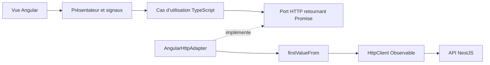

# Comprendre l’utilisation d’Angular et RxJS dans Atlas

## Le choix d’architecture

Le domaine décrit les règles métier et reste du TypeScript sans Angular ni RxJS. Les ports de l’application restent basés sur des Promises pour les requêtes et des callbacks pour les événements. Les adaptateurs Angular traduisent ces contrats vers des Observables.

Cette approche permet de montrer des concepts Angular réels tout en conservant les frontières DDD/hexagonales. DDD n’interdit pas RxJS dans une application; ici, son utilisation est volontairement limitée à l’infrastructure et à la présentation.



## 1. HttpClient et les Observables froids

Fichier : `client/src/app/infrastructure/angular-http.adapter.ts`.

`request$()` appelle `HttpClient.request<T>()` et retourne un `Observable<T>`. Le suffixe `$` est une convention pour reconnaître un flux; il ne change pas son comportement.

Le flux est **froid** : construire l’Observable ne déclenche pas la requête. Un abonnement déclenche son exécution. Deux abonnements indépendants à ce flux peuvent produire deux requêtes; le code applicatif n’en crée qu’un via `firstValueFrom()`.

Le pipeline utilise `catchError()` pour traduire les erreurs HTTP en messages compréhensibles par l’application. `throwError()` conserve le canal d’erreur; une erreur ne devient pas une fausse réussite ni une liste vide.

`request()` adapte le flux au port existant :

```ts
return firstValueFrom(this.request$<T>(path, method, body, credentials));
```

`firstValueFrom()` s’abonne, attend la première réponse, résout la Promise et se désabonne. Le cas d’utilisation peut continuer à utiliser `await` sans dépendre de RxJS.

Un consommateur direct de `request$()` peut se désabonner pour annuler la requête HTTP. Les appels passant par la Promise n’exposent pas cette possibilité d’annulation à leur appelant. Aucune relance automatique des opérations de modification n’est ajoutée.

L’assemblage se trouve dans `client/src/app/composition.providers.ts` : `provideHttpClient()` fournit le client HTTP Angular, puis une factory construit l’adaptateur avec ce client.

## 2. Événements Socket.IO, subscribe et nettoyage

Fichier : `client/src/app/infrastructure/socket-connection.ts`.

`events$()` utilise `fromEventPattern()` pour relier deux opérations :

- À l’abonnement : `socket.on(event, handler)` ajoute un écouteur.
- Au désabonnement : `socket.off(event, handler)` retire exactement cet écouteur.

Les événements Socket.IO peuvent arriver plusieurs fois. Contrairement à une réponse HTTP, ce flux ne se termine pas automatiquement après la première valeur.

Le port applicatif reçoit toujours un callback, grâce à un abonnement explicite :

```ts
this.events$<T>(event).subscribe(handler);
```

L’Observable inclut `takeUntil(this.closed$)`. La fermeture définitive de cette connexion émet dans `closed$`, ce qui termine les abonnements et retire les écouteurs. Un `ReplaySubject<void>(1)` garde la notification de fermeture : même un abonnement créé après la fermeture se termine immédiatement.

Une interruption réseau temporaire ne ferme pas ce sujet : Socket.IO peut se reconnecter avec les mêmes écouteurs. Le sujet est fermé quand on remplace la connexion, se déconnecte explicitement de ce transport ou détruit le service Angular.

Les commandes avec accusé de réception utilisent aussi un Observable. Il émet une réponse puis se termine. Si la connexion est fermée avant cette réponse, la Promise est rejetée immédiatement; un accusé tardif est ignoré.

## 3. Subject, debounceTime et toSignal pour la recherche

Fichier : `client/src/app/presentation/workspace.presenter.ts`.

Le champ de recherche transmet ses changements à `searchChanges$`, un `Subject<string>`. Un Subject permet au code d’émettre des valeurs avec `.next()` et aux consommateurs de s’y abonner.

Le pipeline effectue :

1. `map` : normaliser le texte avec `trim()` et `toLowerCase()`.
2. `debounceTime(200)` : attendre 200 ms sans nouvelle saisie avant de retenir le dernier texte.
3. `distinctUntilChanged()` : éviter de republier deux recherches normalisées identiques.
4. `toSignal(..., { initialValue: '' })` : exposer la dernière recherche comme signal Angular.

Le présentateur utilise ce signal dans `filteredMaps`. La recherche est locale, sur la bibliothèque déjà chargée; elle n’effectue pas une requête serveur par caractère. Les filtres de propriété et les modifications de la liste restent immédiats.

`toSignal()` gère l’abonnement. Il est créé une seule fois dans le présentateur, et non dans un getter appelé à chaque détection de changements. L’abonnement est supprimé quand Angular détruit l’injecteur qui possède ce présentateur.

## 4. toObservable, switchMap, timer et computed pour les déplacements

Fichier : `client/src/app/presentation/session.presenter.ts`.

L’état de session est un signal Angular, mis à jour lors des messages du serveur. `toObservable()` le transforme en flux RxJS.

`switchMap()` choisit le flux de temps à utiliser :

- Si un participant se déplace, `timer(0, 100)` émet immédiatement puis toutes les 100 ms.
- Sinon, `of(Date.now())` émet une valeur et se termine : aucun timer périodique ne reste actif.

Quand la session change, `switchMap()` se désabonne du timer précédent avant de choisir le nouveau flux. Il ne s’accumule donc pas plusieurs timers.

`toSignal()` expose la dernière valeur de temps. Un `computed()` combine cette valeur, le segment courant et les segments restants pour calculer `travelDuration`. La vue se met à jour sans appel manuel à `setInterval()`.

Le serveur reste autoritaire : ce timer sert seulement à afficher une durée. Les règles du déplacement et les arrivées sont calculées dans le domaine serveur.

## 5. Durée de vie des abonnements

| Flux | Gestion de fin |
|---|---|
| Réponse HTTP via le port applicatif | `firstValueFrom()` termine l’abonnement après la première réponse |
| Réponse HTTP consommée directement comme Observable | Fin de la réponse ou désabonnement du consommateur |
| Événements Socket.IO | `takeUntil(closed$)` retire les écouteurs |
| Accusé de réception Socket.IO | Première réponse, erreur ou fermeture de connexion |
| Recherche | Nettoyage automatique de `toSignal()` |
| Timer de déplacement | `switchMap()` remplace le timer; `toSignal()` nettoie à la destruction |

Les présentateurs étant fournis au niveau racine, leur durée de vie est celle de l’application Angular. La navigation entre pages ne détruit pas leurs abonnements, mais le timer devient inactif lorsque plus aucun déplacement n’existe. `ConnectionStateService.ngOnDestroy()` appelle `AtlasClient.dispose()`, qui ferme le transport et empêche une reconnexion tardive.

## 6. Ce qui reste volontairement en Promise

`MapClient`, `AccountClient`, `SessionClient`, les ports applicatifs et les actions de dialogue utilisent encore des Promises. Cette intégration n’est donc pas une conversion de toutes les méthodes en Observables.

Les Observables sont utilisés là où leur comportement est utile : intégration HTTP Angular, événements multiples, temporisation, changements de source et nettoyage d’abonnements. Les règles métier, les agrégats et les cas d’utilisation restent indépendants des mécanismes Angular.

## 7. Parcours pour expliquer le code

- Ouvrir `angular-http.adapter.ts` : expliquer le flux froid, les canaux de réponse/erreur et le pont `firstValueFrom`.
- Ouvrir `socket-connection.ts` : montrer `.subscribe()`, puis identifier précisément qui retire les écouteurs.
- Saisir rapidement un nom dans la bibliothèque : expliquer pourquoi `debounceTime` retient le dernier texte et pourquoi un signal est pratique pour l’affichage.
- Lancer un déplacement : expliquer comment `switchMap` gère le timer et pourquoi le domaine serveur reste responsable du mouvement réel.
- Exécuter `npm run architecture` : montrer que les modèles métier n’importent ni Angular ni RxJS.
- Exécuter `npm test -- --watch=false` : lire les tests de l’adaptateur HTTP, des abonnements Socket.IO et des timers avec une horloge contrôlée.

Il faut pouvoir expliquer ces choix et leurs limites; la présence d’un `.subscribe()` ne suffit pas, à elle seule, à démontrer la maîtrise de RxJS.
