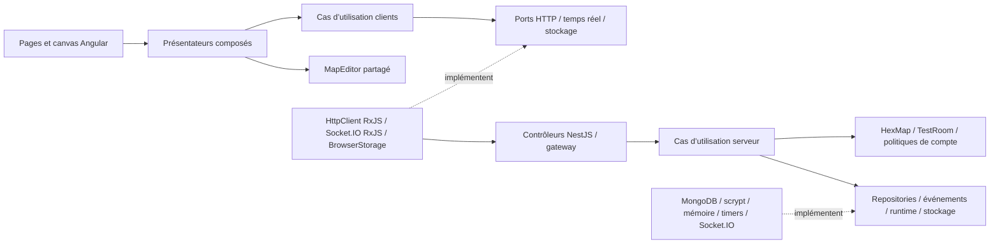

# Architecture DDD et hexagonale

## Décisions

Atlas reste un monolithe modulaire Angular + NestJS + MongoDB. DDD définit les responsabilités métier; l’architecture hexagonale protège ces responsabilités des frameworks et des mécanismes d’entrée/sortie. Aucun microservice, CQRS, event sourcing ou changement de schéma MongoDB n’est nécessaire à cette refonte.

Les imports vont des adaptateurs vers les cas d’utilisation et le domaine. Un cas d’utilisation dépend d’une interface de stockage ou de transport, jamais de Mongoose, Socket.IO, NestJS ou Angular. Les classes métier s’instancient avec des objets TypeScript ordinaires dans les tests.

## Contextes métier

| Contexte | Responsabilités du domaine | Cas d’utilisation | Adaptateurs |
|---|---|---|---|
| Identity | Nom de compte, politique du mot de passe | Inscription, authentification exclusive, reconnexion, révocation, administration | Contrôleurs Identity/Admin, repository MongoDB, hachage scrypt |
| Map Authoring | Agrégat `HexMap`: contenu valide, nom, visibilité, droits du propriétaire | Lister, ouvrir/verrouiller, sauvegarder, dupliquer, changer la visibilité, supprimer | Contrôleur Maps, repository MongoDB |
| Test Sessions | Agrégat `TestRoom`: participants, départs, capacité, configuration, messages, mouvements | Créer, rejoindre, quitter, reprendre, configurer, déplacer et fermer | Gateway NestJS et adaptateur Socket.IO |
| Noyau partagé | Types et snapshots métier, géométrie, validation, Dijkstra, `MapEditor` | Réutilisé par le client et le serveur | Aucun framework |

`MapEditor` possède l’état d’une édition et son historique d’actions. `HexMap` représente la carte sauvegardée avec sa propriété et sa visibilité. `TestRoom` possède un snapshot de carte, les participants, messages et déplacements d’une session. Les snapshots publics de `HexMap` et `TestRoom` sont copiés; modifier une réponse ne modifie pas l’agrégat. Le canvas utilise la vue d’édition en mémoire, dont les mutations passent par `MapEditor`.

Une carte structurellement valide mais inachevée reste sauvegardable. Le démarrage d’un test applique séparément les exigences de quatre départs, de villes et de connexité. Le serveur vérifie toujours ces règles, indépendamment de la validation affichée dans Angular.

Les règles de compte simples utilisent des fonctions de politique plutôt qu’un agrégat artificiel. Les connexions actives et expirations sont des états applicatifs, stockés derrière les ports `Store` et `Runtime`.

## Ports et assemblage

- **MapRepository / AccountRepository** : données ordinaires, aucune requête Mongoose ni document hydraté ne traverse le port.
- **MapAccess / OwnedMaps / IdentityAccess** : contrats publiés permettant les interactions entre contextes. Par exemple, Identity demande la suppression des cartes possédées par un compte via `OwnedMaps`.
- **Store** : verrous, connexions, sessions administrateur, tentatives et salles. `MemoryStore` conserve le comportement mono-instance existant.
- **PasswordHasher** : hachage, comparaison et contrôle du secret administrateur. Seul l’adaptateur scrypt lit ce secret dans l’environnement.
- **Runtime** : temps courant, identifiants, nombres aléatoires et planification. Les tests contrôlent le temps sans attendre réellement.
- **EventBus** : événements applicatifs locaux de révocation et d’invalidation des cartes, avec l’adaptateur `LocalEventBus`. Ce bus n’est ni durable ni distribué.
- **Realtime** : diffusion à une connexion, un groupe ou tous les clients, adhésion et éviction. Seul `SocketRealtime` connaît un serveur Socket.IO.
- **HttpPort / RealtimePort / StoragePort** côté client : remplaçables par des doubles de test sans navigateur ni serveur.

`server-nestjs/app/composition.providers.ts` construit les cas d’utilisation avec leurs adaptateurs, puis `app.module.ts` expose les contrôleurs. Le gateway transforme les messages réseau en appels applicatifs et traduit les résultats en accusés de réception. Le filtre NestJS traduit les erreurs métier vers les codes HTTP existants.

Côté client, `composition.providers.ts` fournit les adaptateurs aux tokens déclarés dans la couche de présentation. `main.ts` installe ces providers. `ConnectionStateService` relie les cellules d’état de l’application aux signaux Angular; les ports applicatifs n’importent pas Angular.

## Flux représentatifs

### Sauvegarder une carte

1. La page appelle le présentateur, qui rassemble les données de l’édition.
2. `MapClient.save` exprime l’action et délègue au port HTTP.
3. Le contrôleur authentifie l’appel puis invoque `MapUseCases.save`.
4. Le cas d’utilisation charge la carte, vérifie le verrou, et demande à `HexMap` d’appliquer les règles.
5. Le repository MongoDB persiste un snapshot, traduit les doublons en erreur métier et retourne les données sérialisées.
6. Le cas d’utilisation publie l’invalidation de la bibliothèque; les clients actualisent leurs listes.

### Déplacer un participant

1. Le gateway transmet l’acteur et la destination à `SessionUseCases.move`.
2. Le cas d’utilisation vérifie l’accès puis demande au domaine de choisir le chemin et le segment courant.
3. Le port temps réel diffuse l’état; `Runtime` planifie l’arrivée.
4. Le domaine ignore une arrivée devenue obsolète après remplacement du snapshot ou départ du joueur.
5. Une annulation vide les segments restants. Le segment courant se termine au centre de la tuile; une nouvelle configuration ne modifie que les segments suivants.

### Suppression d’un compte

Identity révoque ses connexions et appelle le port de nettoyage des cartes. Map Authoring supprime les cartes et publie leurs identifiants. Test Sessions ferme les salles concernées. Le repository de comptes supprime enfin le compte. Ces opérations conservent la sémantique précédente; elles ne constituent pas une transaction distribuée.

## Compatibilité et changements observables

Les routes REST, noms des événements Socket.IO, formes JSON, noms des collections et identifiants MongoDB sont conservés. Les données existantes ne nécessitent pas de migration. Les scripts de démarrage et paramètres d’environnement restent compatibles.

La refonte corrige également deux cas limites: une place est réservée à l’hôte pendant son retour dans l’éditeur, et une carte contenant une tuile nulle est rejetée proprement par la validation métier. La duplication retourne désormais un snapshot sans verrou résiduel.

Les anciens services monolithiques et classes d’actions héritées ont été supprimés. `common/models.ts` et `common/hex.ts` restent de petits points d’entrée compatibles pour le code de présentation; les nouvelles règles métier résident dans `common/domain/`.

## Étendre le projet

Pour une règle de carte, modifier l’agrégat ou une politique du domaine, puis ajouter un test sans framework. Pour une action qui orchestre une sauvegarde ou une notification, ajouter une méthode au cas d’utilisation et lui fournir les ports nécessaires. Ajouter ensuite le contrôleur ou message réseau et le cas d’utilisation client typé.

Pour changer de base de données, fournir une nouvelle implémentation des repositories et modifier l’assemblage. Pour distribuer les sessions, il faudra concevoir un stockage partagé avec concurrence atomique, une coordination des timers et un transport distribué; remplacer simplement `MemoryStore` ne suffit pas, car le port actuel conserve des agrégats en mémoire par référence.

Les boîtes de dialogue, le focus, le routage et les signaux restent dans la présentation. Les règles de placement, d’historique et de déplacement restent dans le domaine. Les URLs et noms de commandes réseau sont cachés aux présentateurs par `MapClient`, `AccountClient` et `SessionClient`.

## Intégration Angular/RxJS

RxJS est utilisé dans les adaptateurs et la présentation Angular. `AngularHttpAdapter.request$()` expose le flux froid de `HttpClient`; `request()` utilise `firstValueFrom()` pour satisfaire le port HTTP applicatif existant. `SocketConnection` transforme les événements en Observables avec `fromEventPattern`, puis implémente le port de callbacks avec `.subscribe()` et `takeUntil` pour la libération des écouteurs.

Dans `WorkspacePresenter`, un `Subject` transmet la recherche à `debounceTime` et `distinctUntilChanged`; `toSignal()` rend sa dernière valeur disponible au filtrage. Dans `SessionPresenter`, `toObservable`, `switchMap`, `timer` et `toSignal()` alimentent une durée calculée, sans intervalle manuel. Les abonnements `toSignal` suivent la durée de vie de l’injecteur Angular. `ConnectionStateService.ngOnDestroy()` ferme la connexion et ses abonnements explicites.

Les couches métier et les cas d’utilisation continuent à ignorer Angular et RxJS. Cette séparation est un choix de conception, pas une obligation de DDD. Le pont Promise ne fournit pas d’annulation HTTP aux appels applicatifs existants; un consommateur direct de `request$()` peut annuler sa requête en se désabonnant. Voir `ANGULAR-RXJS.md` pour les détails et les tests.

## Routage Angular

`app.routes.ts` déclare les pages chargées à la demande. L’assemblage fournit Angular Router avec la stratégie hash; `AppComponent` expose un `router-outlet`. Les templates utilisent `routerLink` et les présentateurs délèguent les navigations programmatiques à `NavigationStateService`. Ce service dérive la page active des événements `NavigationEnd` avec `toSignal()`.

Les guards restent dans `presentation/routing/`. Ils attendent la restauration initiale, contrôlent l’accès et demandent une confirmation observable avant une sortie susceptible de perdre le brouillon. Les opérations de verrou et de session passent par les cas d’utilisation clients existants. Aucun import du Router n’est introduit dans le cœur métier. Voir [ANGULAR-ROUTER.md](ANGULAR-ROUTER.md).

## Vérification des frontières

`npm run architecture` analyse les imports TypeScript du noyau partagé et des couches domain/application. Il rejette les dépendances externes dans le cœur, les imports vers une couche extérieure, les accès directs entre contextes hors ports publiés et les effets de bord globaux tels que `fetch`, `sessionStorage`, `Date.now` ou `setTimeout`. Il complète les tests et la revue de code; il ne prouve pas à lui seul la qualité du modèle métier.

Les deux jobs GitLab exécutent ce contrôle, ESLint, la compilation et les tests. Voir `TESTS.md` et `VALIDATION-RESULTS.md`.

## Limites d’exploitation

Les cartes et comptes sont persistants; les connexions, verrous et sessions de test restent en mémoire. Un redémarrage du serveur les termine. La grâce de reconnexion de 2,5 secondes est conservée. Le déploiement utilise une seule instance NestJS. Aucun déploiement distant ni test multi-navigateurs n’est inclus dans cette refonte.
